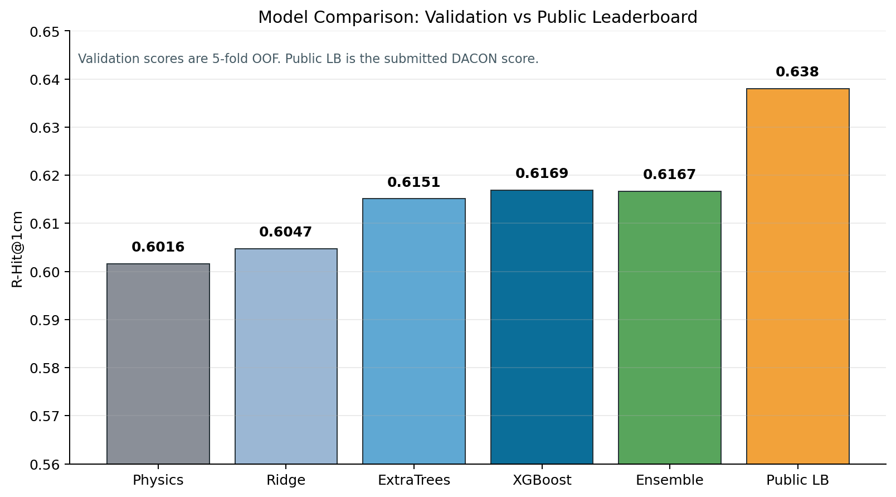
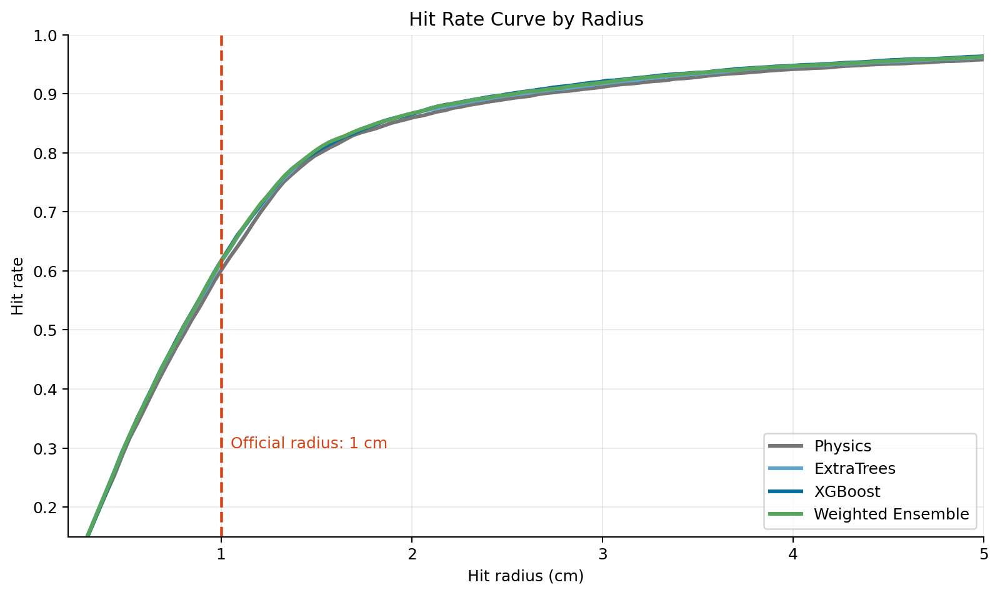
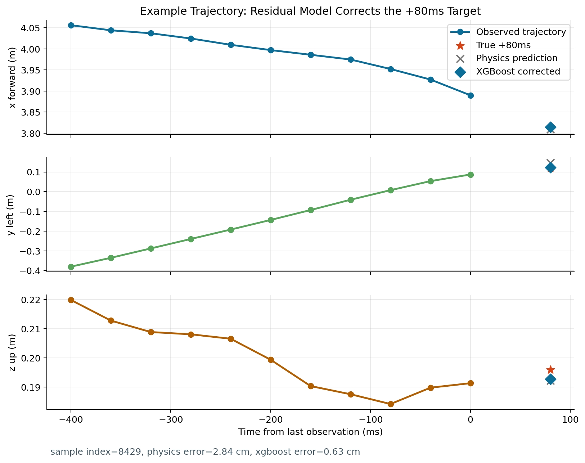
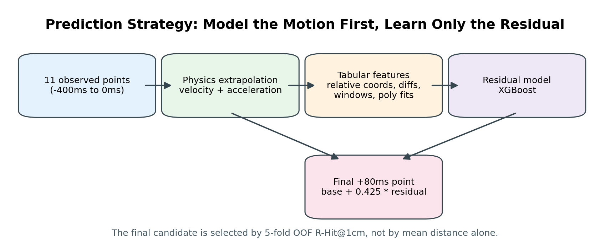
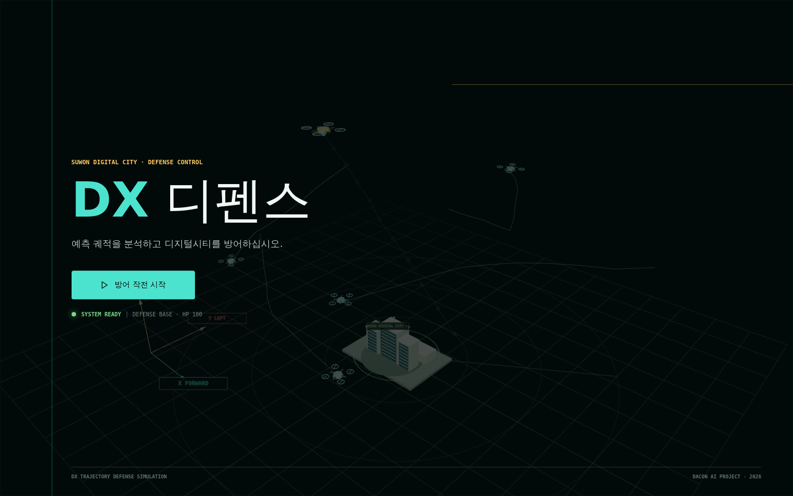
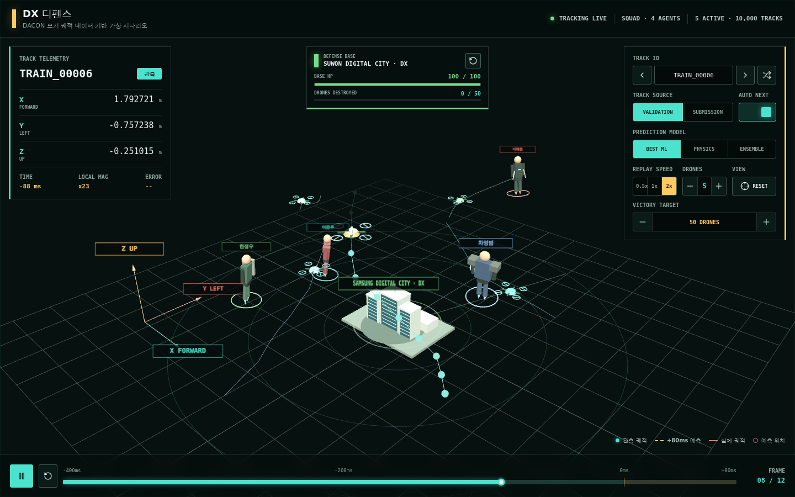
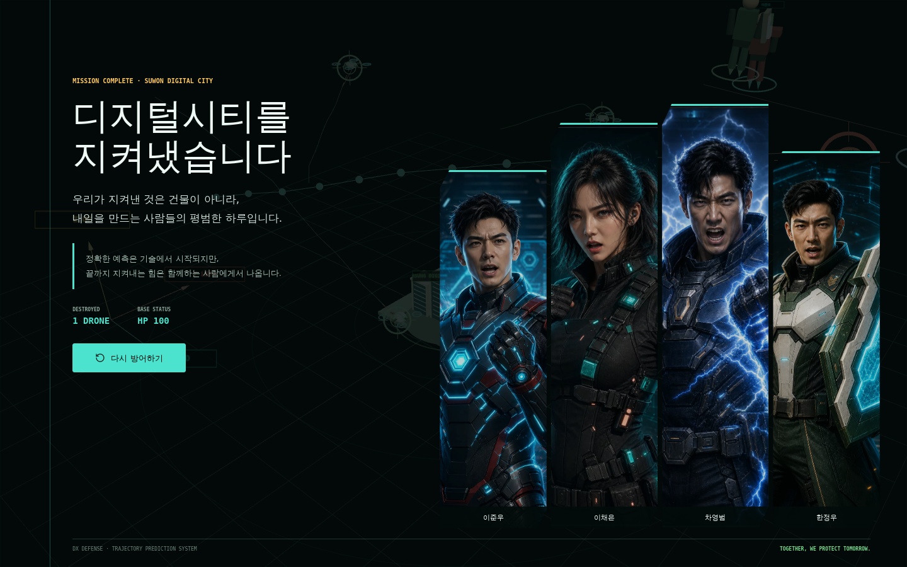

# DACON Mosquito Trajectory Prediction

월간 데이콘 "모기 비행 궤적 예측 AI 경진대회"용 새 프로젝트입니다.

목표는 공식 지표 `R-Hit@1cm`를 높이는 것입니다. 모델 크기나 리소스 제약은 두지 않고, 물리 기반 외삽과 고용량 tabular ensemble을 모두 비교합니다.

## Setup

```bash
cd ~/git/dacon-mosquito-trajectory
python3 -m venv .venv
.venv/bin/python -m pip install -U pip setuptools wheel
.venv/bin/python -m pip install -r requirements.txt
```

`/home/hjw/open.zip`이 있으면 실행 시 `data/open`으로 자동 압축 해제됩니다.

## Recommended Run

공식 지표에 직접 튜닝한 물리식 제출:

```bash
.venv/bin/python run_pipeline.py --profile physics
```

부스팅/앙상블까지 포함한 강한 실험:

```bash
.venv/bin/python run_pipeline.py --profile strong --gpu
```

빠른 sanity check:

```bash
.venv/bin/python run_pipeline.py --profile quick
```

출력은 `outputs/`에 저장됩니다.

## How / Why

이 문제는 40ms 간격으로 관측된 11개 좌표를 이용해 마지막 관측 시점 기준 80ms 뒤 위치를 예측하는 문제입니다. 80ms는 데이터 간격 기준으로 정확히 2 step 뒤이므로, 먼저 복잡한 모델을 쓰기보다 최근 운동량을 이용한 외삽이 강한 기준선이 됩니다.

초기 기준선은 마지막 좌표에 최근 속도를 2 step만큼 더하는 방식입니다.

```text
prediction = p[0ms] + 2 * (p[0ms] - p[-40ms])
```

하지만 모기 궤적에는 짧은 구간에서도 방향 변화가 있으므로, 최근 가속도 항을 함께 사용했습니다. 다만 가속도를 물리식 그대로 크게 반영하면 노이즈까지 증폭되기 때문에, train label에서 공식 지표 `R-Hit@1cm`가 가장 높아지는 계수를 직접 탐색했습니다.

최종 물리 기반식은 다음과 같습니다.

```text
prediction = last + 1.9890 * velocity + 0.5225 * acceleration
velocity = p[0ms] - p[-40ms]
acceleration = p[0ms] - 2 * p[-40ms] + p[-80ms]
```

이후 모델은 전체 좌표를 처음부터 다시 예측하지 않고, 위 물리식의 잔차만 학습하도록 구성했습니다. 이렇게 한 이유는 다음과 같습니다.

- 11개 시점, 3개 좌표만 주어지는 짧은 시계열이라 기본 운동 패턴은 물리 외삽이 이미 잘 설명합니다.
- 모델이 절대 좌표를 직접 외우는 것을 줄이고, 예측 실패분인 잔차에 집중하게 만들 수 있습니다.
- 학습/평가 환경이 다르므로 공간 구조 암기보다 sensor-local 운동 패턴 일반화가 중요합니다.
- 공식 지표가 평균 거리 오차가 아니라 `1cm 이내 명중률`이므로, 잔차 보정 후에도 별도 scale을 탐색해 hit rate를 직접 최적화했습니다.

특성은 좌표 원본, 마지막 좌표 기준 상대 위치, 1차 차분(속도), 2차 차분(가속도), 3차 차분, window별 통계량, 다항 외삽 결과를 tabular feature로 만들었습니다. 데이터 크기가 10,000개이고 각 샘플의 시계열 길이가 11로 짧기 때문에, 대형 딥러닝 시퀀스 모델보다 gradient boosting/tree ensemble이 더 안정적으로 검증 성능을 냈습니다.

최종 선택은 5-fold OOF 검증에서 `R-Hit@1cm`가 가장 높은 후보를 기준으로 했습니다. 현재 가장 좋은 후보는 물리식 예측에 XGBoost 잔차 보정을 `0.425`배 적용한 `xgboost_scaled`입니다.

```text
physics baseline:   R-Hit@1cm=0.6016
ridge residual:     R-Hit@1cm=0.6047
extra trees:        R-Hit@1cm=0.6151
xgboost residual:   R-Hit@1cm=0.6169
weighted ensemble:  R-Hit@1cm=0.6167
```

## Why Machine Learning, Not Deep Learning

이 프로젝트에서는 딥러닝 시계열 모델보다 XGBoost/ExtraTrees 같은 머신러닝 모델이 문제 구조에 더 잘 맞는다고 판단했습니다.

- 입력 시계열이 11개 시점으로 매우 짧아 LSTM/Transformer가 장기 패턴을 학습할 이점이 작습니다.
- 예측 시점이 +80ms, 즉 정확히 2 step 뒤라 최근 속도와 가속도 기반 외삽이 이미 강한 기준선입니다.
- 학습 샘플 10,000개는 tabular boosting에는 충분하지만, 큰 딥러닝 모델에는 과적합 위험이 있습니다.
- 평가 지표가 평균 오차가 아니라 `R-Hit@1cm`이므로, 물리식 잔차를 보정한 뒤 scale을 조정하는 방식이 지표 최적화에 유리했습니다.
- 상대 좌표, 속도, 가속도, window 통계, 다항 외삽값처럼 사람이 설계한 feature가 문제 정보를 잘 드러내므로 tree boosting 계열이 안정적으로 성능을 냈습니다.

따라서 접근 방향은 `물리 기반 예측으로 큰 움직임을 설명하고, 머신러닝으로 남은 잔차만 보정하는 방식`으로 정리했습니다.

## Presentation Figures

아래 그림은 발표 자료에 바로 넣을 수 있도록 `docs/figures/`에 PNG로 저장했습니다. 새 실험 결과가 생기면 다음 명령으로 다시 생성할 수 있습니다.

```bash
.venv/bin/python scripts/make_figures.py
```

### Model Performance

검증 기준 성능과 DACON public leaderboard 점수를 함께 비교한 그래프입니다.



### Hit Rate Curve

반경이 커질 때 모델별 hit rate가 어떻게 변하는지 보여줍니다. 빨간 점선은 공식 평가 반경인 1cm입니다.



### Example Trajectory

관측된 11개 좌표와 +80ms 실제 좌표, 물리식 예측, XGBoost 보정 예측을 한 샘플에서 비교했습니다.



### Pipeline Overview

전체 접근 흐름을 발표용 도식으로 정리했습니다.



## Interactive UAV Visualization

`visualization/`에는 11개 관측 좌표와 `+80ms` 예측 좌표를 실시간으로 재생하는 Three.js 기반 3D 시각화가 포함되어 있습니다. 원래 모기 궤적을 발표용 북한 무인기 추적 시나리오로 재해석한 것으로, 실제 북한 무인기나 군사 센서 데이터가 아닙니다.








```bash
git clone https://github.com/HANJEONGWOO/dacon-mosquito-trajectory.git
cd dacon-mosquito-trajectory/visualization
npm install
npm run dev
```

궤적 데이터가 저장소에 포함되어 있으므로 별도 데이터 준비 없이 실행됩니다. 로컬 브라우저에서는 `http://localhost:4173`, 포트포워딩된 PC에서는 `http://공인IP:외부포트`로 접속할 수 있습니다.

- `DX 디펜스` 작전 인트로에서 시작되는 게임형 시연 흐름
- 이준우(기술 장갑), 이채은(잠입), 차영범(전격), 한정우(방어 지휘)를 0~4명 자유롭게 편성
- 영웅 선택 시 전투 초상화 전환, 캐릭터별 한국어 기합과 에너지 충격음 재생
- 선택 영웅의 3D 호위 비행과 MISS 발생 시 무작위 영웅 고유 공격·드론 파괴
- 기본 10대인 승리 목표 설정, 파괴 진행률 HUD와 목표 달성 아웃트로
- 승리 시 디지털시티·네 영웅·최종 전적과 함께 표시되는 엔딩 메시지
- 서로 다른 궤적을 동시에 비행하는 다중 3D 드론(1~10대 설정, 기본 5대)
- `submission_best.csv`, `submission_physics.csv`, `submission_ensemble.csv` 예측 비교
- 기본 2배속 재생과 비행 편대 크기만큼 다음 Track 묶음 자동 진행
- 자동 진행 토글, 샘플 ID 이동, 무작위 선택, 재생/정지, 속도 변경
- 5-fold OOF 검증 데이터의 실제 `R-Hit@1cm` 성공/실패 판정
- 수원 삼성 디지털시티 DX를 모티브로 한 중앙 3D 기지
- 초기 HP 100, 영웅 미편성 MISS 공격 충돌당 HP 1 감소 및 체력 초기화
- HIT 시 디지털시티 기지 요격탄 발사·드론 폭발·충격파 효과
- 영웅 미편성 MISS 시 무인기 기지 공격과 HP 피해 효과
- 마우스 드래그/휠 기반 3D 카메라 조작
- 실제 sensor-local 좌표 텔레메트리와 샘플별 자동 시각 배율

`VALIDATION` 모드는 학습 궤적, 실제 `+80ms` 정답, OOF 예측을 사용하므로 샘플별 HIT/MISS를 판정할 수 있습니다. `SUBMISSION` 모드는 정답이 공개되지 않은 테스트 데이터이므로 성공/실패를 임의로 표시하지 않습니다.

`visualization/public/data/trajectories.json`에는 시연에 필요한 검증/제출 궤적과 모델 예측이 포함되어 있습니다. 원본 데이터나 예측 결과를 변경한 경우에만 개발 환경에서 `npm run prepare-data`로 다시 생성하면 됩니다.

## Current Result

현재 `--profile strong --gpu` 실행 결과, 최종 제출 파일은 `outputs/submission_best.csv`입니다. 선택된 모델은 `xgboost_scaled`이며, 물리 기반 예측값에 XGBoost 잔차 예측을 scale `0.425`로 반영합니다.

```text
constant velocity: R-Hit@1cm=0.5788
tuned physics:     R-Hit@1cm=0.6016
best xgboost:      R-Hit@1cm=0.6169
```

## Leaderboard

DACON 제출 리더보드 기록입니다.

- URL: https://dacon.io/competitions/official/236716/leaderboard?tab=submit
- Rank: 347등
- User: 한정우1917
- Public score: 0.638
